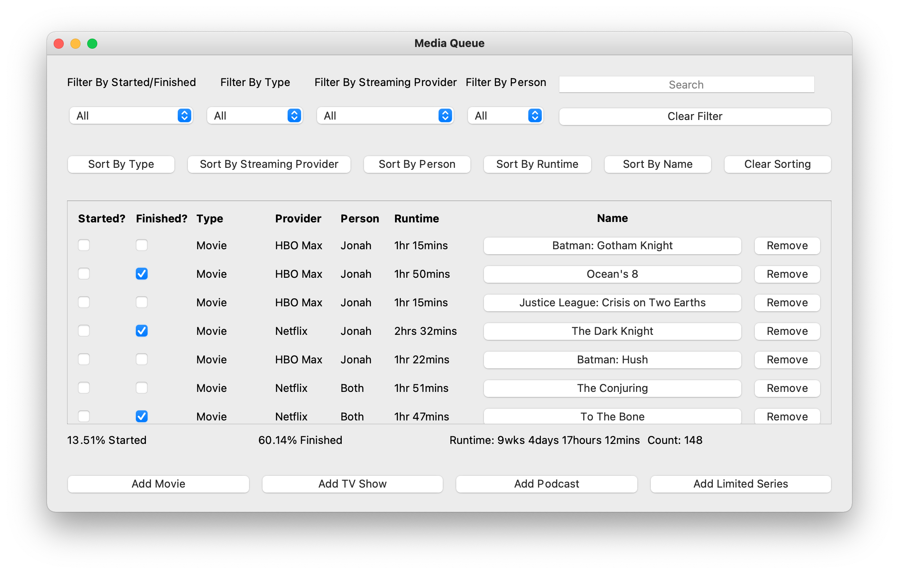
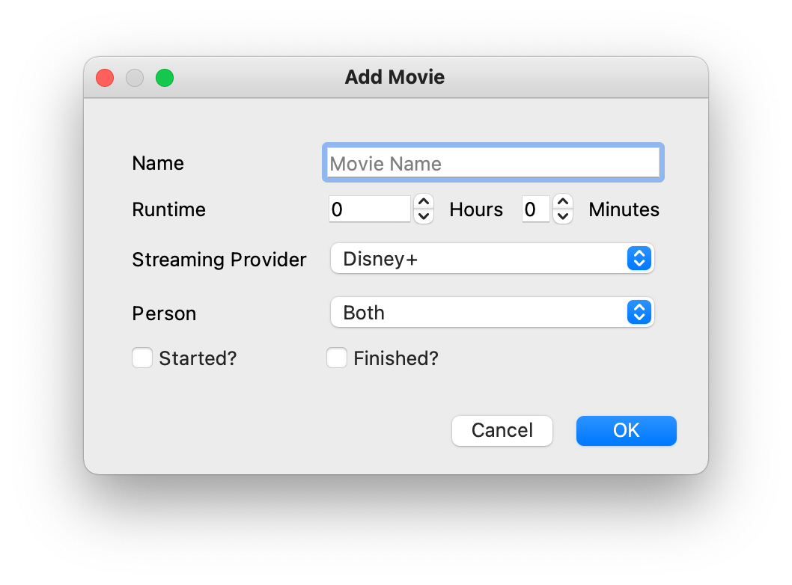
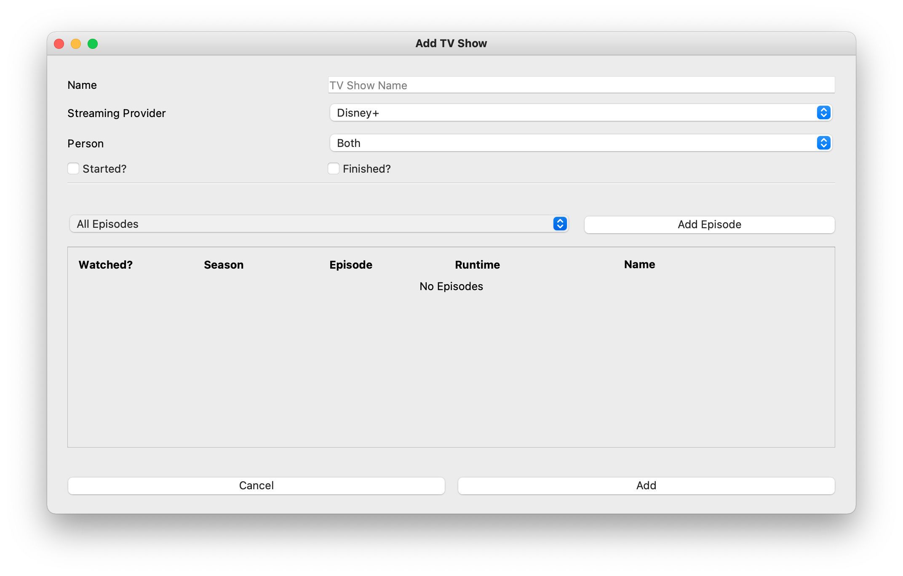
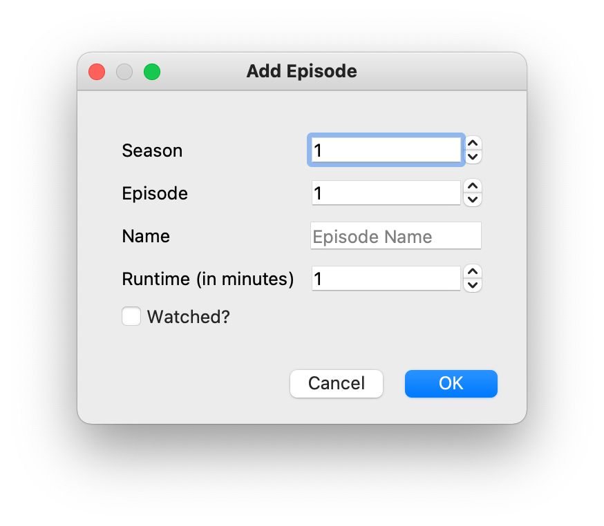
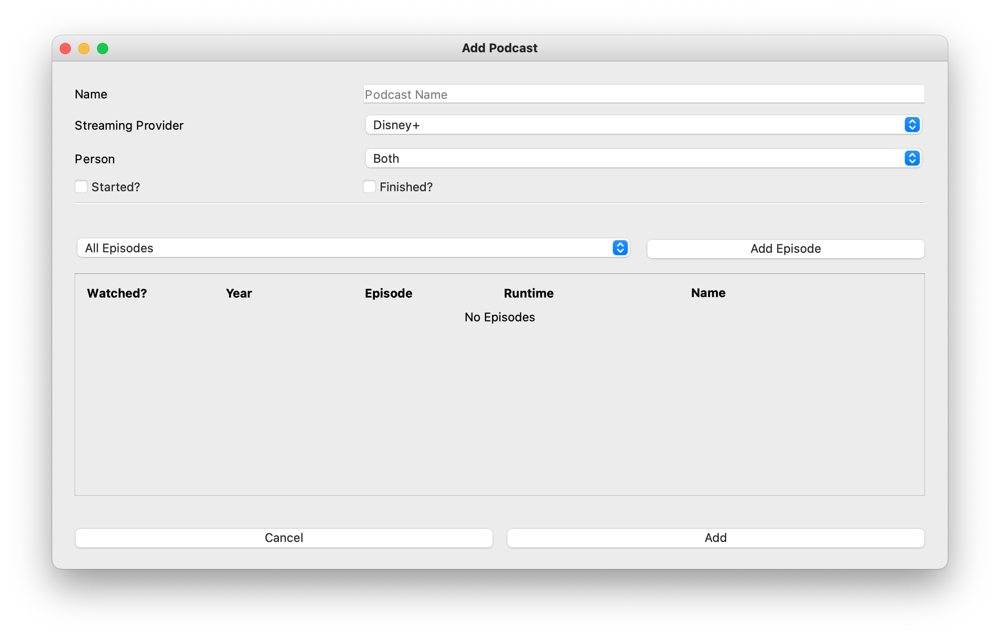
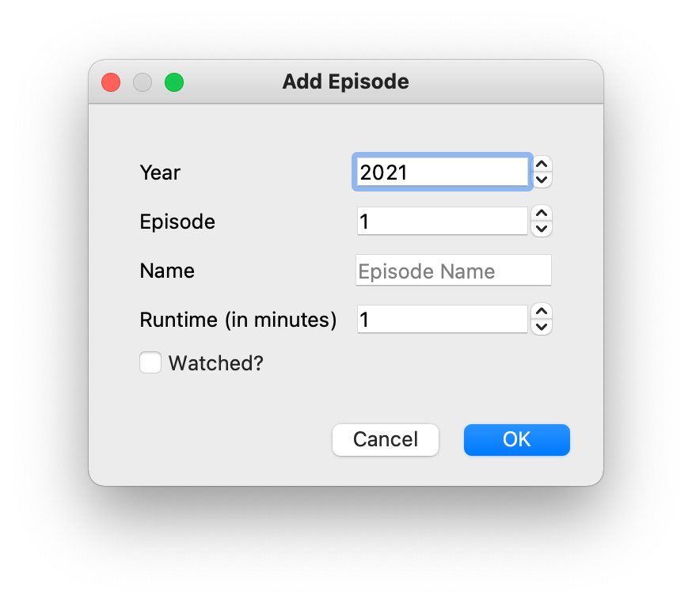
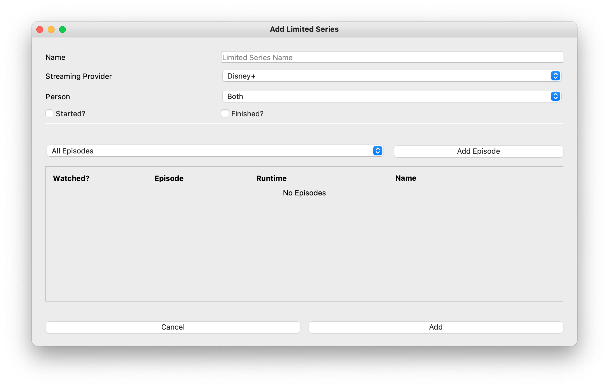
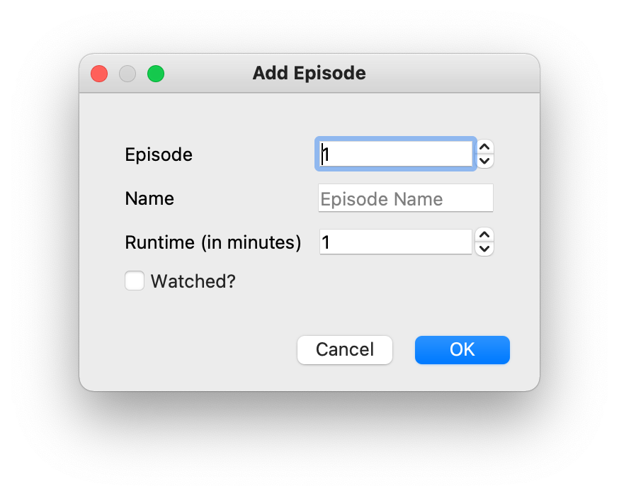

# Media Queue
___
The Media Queue app lets you view, add, or modify any Movies, TV Shows, Podcasts,
or Limited Series you are watching, have already watched, or have yet to watch.

It acts as a sort of "wish list" for anything you want to watch on any Streaming Provider
that you may choose. The details of that will be explained below.
___
## Using The Media Queue

### Configuring Streaming Providers and People
The Media Queue comes with 2 default Streaming Providers:
 * **Default**: *This is in case you don't know the Streaming Provider yet*
 * **Unavailable**: *This is whenever something you want to watch isn't available on anything you subscribe to or have yet*

It also comes with 1 default person:
 * **Default**: *This is in case you only keep track of yourself and not other people*

Using the menu bar, underneath the `Options` menu, you can configure both of these.
You can also use a shortcut `Ctrl+1` for Streaming Providers, `Ctrl+2` for People.

### The Home Screen
On the Home Screen, like shown below, there are a lot of things to take in.


#### Filters & Searching
As you can see in the image above, there are filter dropdown boxes, so you can easily filter
by media type (like Movies, TVShows, etc.), by Streaming Provider, by Person, and by its started/finished status.
* Note: Every time you add a new Streaming Provider or Person, that option immediately becomes
available in the filter dropdown boxes.

You can also search for something specific in the list, and the results will appear as you type.

### Adding or Editing a Movie
By clicking on the Add Movie button, you can easily add a Movie to the media list.


As you can see above, the simple fields of Name, Runtime (hours and minutes), the Streaming Provider, 
and the Person will be required to be specified.

If you try to set the started and finished checkboxes as both to checked, it won't let you 
because, logically, you cannot have started and finished something at the same time even if you have already
seen the Movie.

Editing a Movie is simply done by clicking on the name of an existing Movie you have in your Media queue
and editing the data from there. All the data from the Movie is loaded into the dialog when that happens.

### Adding or Editing a TV Show
By clicking on the Add TV Show button, you can easily add a TV Show to the Media Queue.


Whenever you add a TV Show, you don't necessarily have to specify any Episodes yet.
All you need to do is give it a name, and you can add it directly to your Media Queue

Editing a TV Show is simply done by clicking on the name of an existing TV Show you have in your Media queue
and editing the data from there. All the data from the TV Show is loaded into the dialog when that happens.

#### Adding or Editing an Episode in a TV Show

When adding, or editing, an Episode that exists in a TV Show, there exists a Season number box,
an Episode number box, the entry to type the name of the Episode, how long the Episode is (in minutes),
and whether you've watched it in its entirety.

Note that this differs from Podcasts and Limited Series, as will be explained below.

### Adding or Editing a Podcast
By clicking on the Add Podcast button, you can easily add a Podcast you may be listening to
in your free time.


The details of a Podcast are virtually the same as that of a TV Show apart from the fact that
Episodes are separated by what year they were released versus them being part of a Season, like a TV Show is.

Editing a Podcast is simply done by clicking on the name of an existing Podcast you have in your Media queue
and editing the data from there. All the data from the Podcast is loaded into the dialog when that happens.

#### Adding or Editing an Episode in a Podcast

When adding, or editing, an Episode in a Podcast, note that instead of the Season option
like shown in the TV Show, there is a Year option which has a super low setting of 1900, just to be safe.

### Adding or Editing a Limited Series
By clicking on the Add Limited Series button, you can add a Limited Series to your Media Queue too!


As with the TV Show and Podcast options, the Limited Series has virtually the same exact data except
a Limited Series lacks the idea of Seasons. In the Limited Series' case, there are only Episodes that exist.

Editing a Limited Series is simply done by clicking on the name of an existing Limited Series you have in your Media queue
and editing the data from there. All the data from the Limited Series is loaded into the dialog when that happens.

#### Adding or Editing an Episode in a Limited Series

As you can see, the Season option is entirely removed from the dialog to add a new Episode into a Limited Series.
This is on purpose due to what I said above, that a Limited Series doesn't technically have Seasons.

___
## Importing and Exporting
With the Media Queue, you can easily import and export any files from in a JSON or CSV format
that exists with media that a friend, or other people who use this, have put out there in order to 
make it easier to create instances for TV Shows that you watch that others may also watch.
 * Don't even get me started on *Supernatural* and its **_15_** Seasons

### To/From JSON
To import something from JSON, you can go to the menu bar and select `File` > `Import Media` > `From JSON` (or simply use the keyboard shortcut):
* **MacOS**: `Cmd`+`O` (as in the letter O)
* **Windows**: `Ctrl`+`O` (as in the letter O)

From there, you can select which JSON files you want to import.

The format of a JSON file should be a list of JSON objects such as the following
where the type of Media is specified in its own key.
```json
[
  {
    "type": "Movie",
    "name": "Avengers: Endgame",
    "provider": "Disney+",
    "person": "Default",
    "started": false,
    "finished": false
  } // Other Media
]
```

#### Exporting All Media
To export all your Media into a single JSON file, you simply select `File` > `Export All Media` > `To JSON` (or simply use the keyboard shortcut):
* **MacOS**: `Option`+`S`
* **Windows**: `Alt`+`S`

This will export all your media into a JSON file underneath a folder that is created called `exports`

#### Exporting One Piece of Media
To export a single Movie, TV Show, etc., all you have to do is select what you want to export, and, in the menu bar, select
`File` > `Export Current Media` > `To JSON` (or simply use the keyboard shortcut):
* **MacOS**: `Cmd`+`S`
* **Windows**: `Ctrl`+`S`

This will export that one piece of media into a JSON file, also underneath the `exports` folder

### To/From CSV
To import something from CSV, you can go to the menu bar and select `File` > `Import Media` > `From CSV`
(or simply use the keyboard shortcut):
* **MacOS**: `Cmd`+`Shift`+`O` (as in the letter O)
* **Windows**: `Ctrl`+`Shift`+`O` (as in the letter O)

From there, you can select which CSV files you want to import.

The format of a CSV file, which differs from an actual CSV file used for Google Sheets, Numbers, or Microsoft Excel,
should follow a format similar to the following:
```sql
Movie
"Avengers: Endgame",182,Netflix,Default,True,False

LimitedSeries
"The Queen's Gambit",Netflix,Default,False,True
1,1,"Openings",59,True
1,2,"Exchanges",65,True
1,3,"Doubled Pawns",46,True
1,4,"Middle Game",48,True
1,5,"Fork",48,True
1,6,"Adjournment",60,True
1,7,"End Game",67,True
```
There are multiple things to note about the format of the CSV file:
1. The type of Media should come before the data for the media:
    1. `Movie`, `TVShow`, `LimitedSeries`, `Podcast` are valid types
1. In TV Shows, Podcasts, and Limited Series', the Episodes are listed including their season number
as a list of Episodes right below the show data (like shown with *The Queen's Gambit*)
1. There can be blank lines in between if it helps to separate certain pieces of Media from one another or 
when separating seasons from one another which can be especially helpful in longer running shows (like *Supernatural* or *Grey's Anatomy* which 
   both meet or exceed 15 seasons)
1. The only thing that *__needs__* to be in quotes is the name of the Media and the Episodes underneath (if applicable)
    1. This is required in case any episodes have commas in them which would break the CSV format if there were no quotes
    
#### Exporting All Media
To export all your Media into a single CSV file, you simply select `File` > `Export All Media` > `To CSV` (or simply use the keyboard shortcut):
* **MacOS**: `Option`+`Shift`+`S`
* **Windows**: `Alt`+`Shift`+`S`

This will export all your media into a CSV file underneath a folder that is created called `exports`

#### Exporting One Piece of Media
To export a single Movie, TV Show, etc., all you have to do is select what you want to export, and, in the menu bar, select
`File` > `Export Current Media` > `To CSV` (or simply use the keyboard shortcut):
* **MacOS**: `Cmd`+`Shift`+`S`
* **Windows**: `Ctrl`+`Shift`+`S`

This will export that one piece of media into a CSV file, also underneath the `exports` folder
___
## Feedback

### Reporting Bugs & Requesting Features
If you find any bugs while using Media Queue, please don't hesitate to report a bug!

In addition, if you think of anything that *may* be helpful to others using it, you can request that feature!

Under the `Help` menu in the menu bar, there is an option to do both which holds a link to direct you to my
GitHub page where can fill out an "issue" (also available [here](https://github.com/FellowHashbrown/MediaQueue/issues/new/choose)) 
Select the one which you would like to do and follow the instructions
inside to complete your Bug Report or Feature Request!

### Other Feedback
If you have any other feedback, you can also head over to the same link provided and create an issue from scratch!